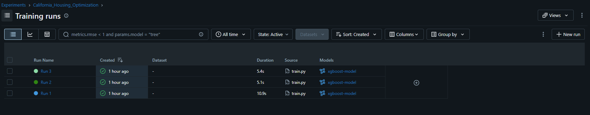
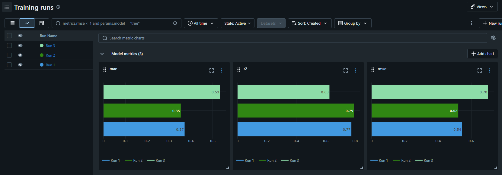

# MLflow Experiment Tracking: California Housing


Tracking and comparing three XGBoost regression experiments on the California Housing dataset with MLflow. Each run logs its parameters, validation metrics (RMSE, MAE, R²) and the trained model, and the best configuration is selected by **RMSE**.


## Description

- **Problem:** House price prediction (regression) on the California Housing dataset.
- **Split:** 80% training / 20% validation, fixed random seed (`42`) for reproducibility.
- **Model:** XGBoost regressor, 100 boosting rounds, trained three times with different hyperparameters.
- **Tracked per run:** parameters (`max_depth`, `learning_rate`), metrics (RMSE, MAE, R²) and the model artifact.
- **Selection metric:** RMSE (lowest wins).

| Experiment | Max Depth | Learning Rate |
|---|---|---|
| Run 1 | 3 | 0.1 |
| Run 2 | 5 | 0.05 |
| Run 3 | 7 | 0.01 |

## Project Structure

```
mlflow-california-housing/
├── train.py             # loads data, splits, trains 3 runs, logs to MLflow
├── requirements.txt    
├── README.md            
├── screenshots/         # MLflow UI screenshots used in the docs
└── .gitignore
```

## How to Run

**1. Clone and set up the environment**

```bash
git clone https://github.com/MariamTareq2211/mlflow-california-housing.git
cd mlflow-california-housing
python -m venv mlops-env
# Windows:  mlops-env\Scripts\activate
# Linux/Mac: source mlops-env/bin/activate
pip install -r requirements.txt
```

**2. Start the MLflow tracking server** (in a separate terminal, same environment)

```bash
mlflow server --backend-store-uri sqlite:///mlruns.db --default-artifact-root ./artifacts --host 127.0.0.1 --port 5000
```

**3. Run the experiments**

```bash
python train.py
```

**4. Open the MLflow UI** at http://127.0.0.1:5000 and select the `California_Housing_Optimization` experiment.

## Results

### MLflow experiment screenshot



### Comparison table

| Run | Max Depth | Learning Rate | RMSE | MAE | R² |
|---|---|---|---|---|---|
| Run 1 | 3 | 0.1 | 0.5433 | 0.3710 | 0.7747 |
| Run 2 | 5 | 0.05 | 0.5215 | 0.3534 | 0.7924 |
| Run 3 | 7 | 0.01 | 0.7006 | 0.5329 | 0.6254 |



## Selected Best Model

**Run 2** (`max_depth = 5`, `learning_rate = 0.05`) with the lowest validation RMSE of **0.5215**.

### Why this model?

RMSE was the required primary metric, and Run 2 achieved the lowest value (0.52), compared with 0.54 for Run 1 and 0.70 for Run 3. MAE and R² point the same way: Run 2 also has the lowest MAE (0.35 vs 0.37 and 0.53) and the highest R² (0.79 vs 0.77 and 0.63), so the ranking is consistent across all three metrics.

The hyperparameters explain the gap. All runs used the same 100 boosting rounds, so the learning rate controls how far the model can learn in that budget. Run 3 (learning rate 0.01) learns very slowly, so even with the deepest trees (depth 7) it likely underfits, which is why it has the highest error. Run 1 (depth 3, learning rate 0.1) converges quickly but its shallow trees have less capacity, so it lands slightly behind Run 2. Run 2 balances the two with moderately deep trees and a moderate learning rate, which gives the best fit within 100 rounds.

Note that the difference between Run 1 and Run 2 is small (0.02 RMSE), so a different seed, split or number of boosting rounds could change the ranking. Run 2 is the best configuration under the setup used here.

## Tech Stack

Python · MLflow · XGBoost · scikit-learn · NumPy · SQLite (tracking backend)

## Notes

- Every run is reproducible: the data split and the model both use `seed = 42`.
- Models are stored as MLflow artifacts under `./artifacts` and can be loaded with `mlflow.xgboost.load_model("runs:/<run_id>/xgboost-model")`.
